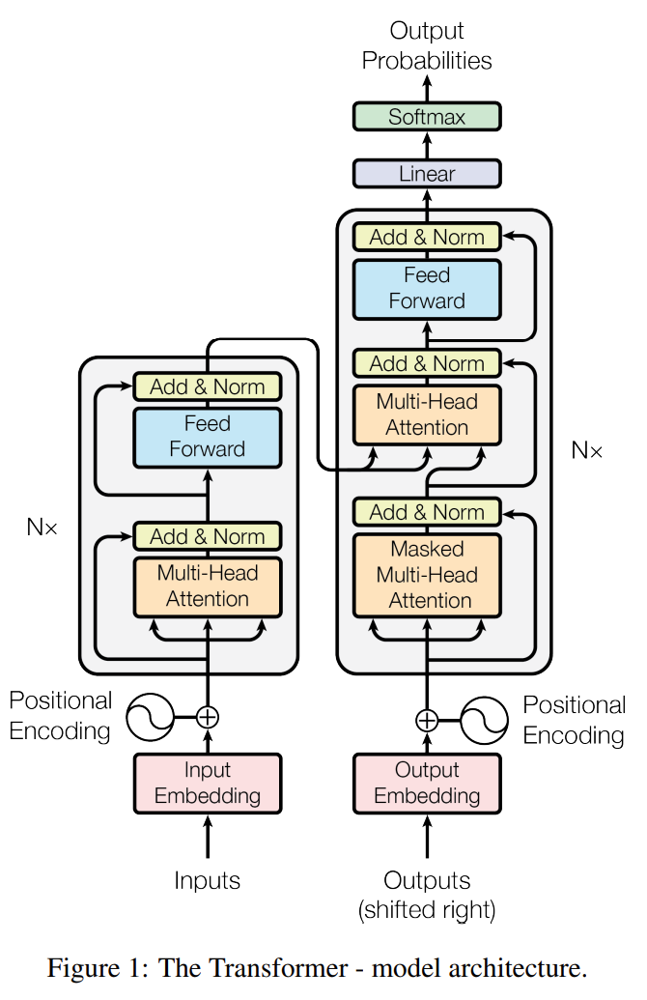

# Attention Is All You Need
In this project, I re-implemented the full Transformer architecture from Vaswani et al. (2017) in PyTorch, covering both the encoder and decoder stacks. Using only one NVIDIA RTX 4080 GPU, I trained one model on an English-to-German translation task via the Multi30k dataset, and another model on an English-to-Czech translation task using the WMT19 dataset—which contains millions of sentence pairs—but subsampled 100,000 examples for demonstration.

The Transformer replaces recurrent layers with **multi-head self-attention**, enabling significantly faster training and improved long-range dependency modeling. This repo provides the complete end-to-end training pipeline.

> For complete details, benchmarks, loss curves, and code snippets, see: https://mahermah.com/blog/transformer-reimplementation

Paper details:
- Published: 2017-06
- Link: https://arxiv.org/abs/1706.03762

## Quick Start
Follow these steps to set up and run this project:

1. **Clone the repository**

    ```bash
    git clone https://github.com/Mahmh/ml-research-papers
    cd attention-is-all-you-need
    ```

2. **Create and activate a virtual environment**

    - **Unix / macOS**  
      ```bash
      python3 -m venv venv
      source venv/bin/activate
      ```
    - **Windows (PowerShell)**  
      ```powershell
      python -m venv venv
      .\venv\Scripts\Activate.ps1
      ```

3. **Install dependencies**
    ```bash
    pip install --upgrade pip
    pip install -r requirements.txt
    ```

4. **Run the project**
    - **Launch JupyterLab**  
      ```bash
      jupyter lab
      ```
    - **Or train from the command line**  
      ```bash
      python train.py
      ```

5. **Inspect outputs**
    After training, artifacts are saved under `checkpoints/<timestamp>/`, including:
    - `model_final.pt` (model weights)
    - `loss_curve.png` (training & validation loss curves)  
    - `metadata.json` (hyperparameters & final train/val/test results)

6. **Load a checkpoint for inference**

    ```python
    from lib.wmt19_model_utils import load_model
    model = load_model("checkpoints/20250704_165351")
    translate(model, 'An English sentence')
    ```


## Preview



*Figure from “Attention Is All You Need,” Vaswani et al., 2017 © Google (used with permission).*