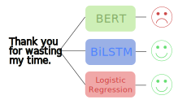

# BERT: Pre-training of Deep Bidirectional Transformers for Language Understanding


In this project, I fine-tuned and evaluated several models on the Stanford IMDb movie review sentiment analysis dataset (50,000 labeled examples). The goal is to compare performance across different architectures on a deep language-understanding task (i.e., sentiment analysis):

- **BERT** (Devlin et al., 2018)
- **BiLSTM**  
- **Logistic Regression**

You’ll find end-to-end training pipelines, evaluation scripts, and sample inference code for each model.

> For full details, benchmark tables, loss/accuracy curves, and code snippets, see: https://example.com/blog/bert-language-understanding

Paper details:
- Published: 2018-10
- Link: https://arxiv.org/abs/1810.04805

## Quick Start
Follow these steps to set up and run this project:

1. **Clone the repository**

    ```bash
    git clone https://github.com/Mahmh/ml-research-papers
    ```

2. **Create and activate a virtual environment**

    - **Unix / macOS**  
      ```bash
      python3 -m venv venv
      source venv/bin/activate
      pip install -e .
      cd bert
      ```
    - **Windows (PowerShell)**  
      ```powershell
      python -m venv venv
      .\venv\Scripts\Activate.ps1
      pip install -e .
      cd bert
      ```

3. **Install dependencies**
    ```bash
    pip install --upgrade pip
    pip install -r requirements.txt
    ```

4. **Run the project (JupyterLab)**
    ```bash
    jupyter lab
    ```

5. **Inspect outputs**
    After training, artifacts are saved under `checkpoints/<model>/<timestamp>/`, including:
    - `model_best_epoch<epoch_number>.pt` (model weights)
    - `loss_curve.png` (training & validation loss curves)  
    - `metadata.json` (hyperparameters & final train/val/test results)

6. **Load a checkpoint for inference (example)**

    ```python
    from lib.bert.model import BERTClassifier, infer
    from lib.bert.config import BERTConfig
    from lib.utils import load_checkpoint

    model, _, _, _, bert_config = load_checkpoint(
        "./checkpoints/bert/20250717_210531",
        BERTClassifier,
        BERTConfig
    )

    infer(model, text=input("Type a movie review: "), config=BERTConfig())
    ```