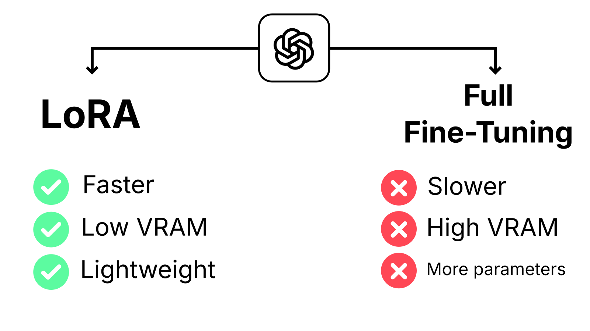

# LoRA: Low-Rank Adaptation of Large Language Models


This project demonstrates fine-tuning a [Qwen2.5-1.5B-Instruct model](https://huggingface.co/Qwen/Qwen2.5-1.5B-Instruct) on the [Yahma dataset (50K examples)](https://huggingface.co/datasets/yahma/alpaca-cleaned) using an NVIDIA RTX 4080 (16 GB). The process is compared with and without the use of LoRA (Low-Rank Adaptation), showcasing its efficiency in reducing computational requirements while maintaining performance.

Paper details:
- Published: 2021-06
- Link: https://arxiv.org/abs/2106.09685

## Quick Start
Follow these steps to set up and run this project:

1. **Clone the repository**

    ```bash
    git clone https://github.com/Mahmh/ml-research-papers
    ```

2. **Create and activate a virtual environment**

    - **Unix / macOS**  
      ```bash
      python3 -m venv venv
      source venv/bin/activate
      pip install -e .
      cd lora
      ```
    - **Windows (PowerShell)**  
      ```powershell
      python -m venv venv
      .\venv\Scripts\Activate.ps1
      pip install -e .
      cd lora
      ```

3. **Install dependencies**
    ```bash
    pip install --upgrade pip
    pip install -r requirements.txt
    ```

4. **Launch the notebook**
    ```bash
    jupyter lab
    ```