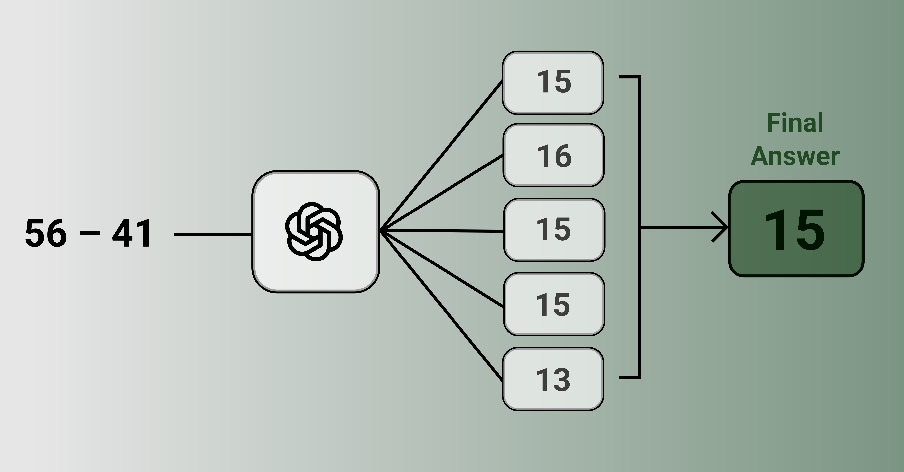

# Self-Consistency Improves Chain of Thought Reasoning in Language Models


This project investigates the use of self-consistency in Chain-of-Thought (CoT) reasoning to enhance the performance of large language models. By employing self-consistency, models generate multiple reasoning paths and select the most consistent answer, leading to improved accuracy on tasks requiring complex reasoning and decision-making.

Paper details:
- Published: 2022-03
- Link: https://arxiv.org/abs/2203.11171

## Quick Start
Follow these steps to set up and run this project:

1. **Clone the repository**

    ```bash
    git clone https://github.com/Mahmh/ml-research-papers
    ```

2. **Create and activate a virtual environment**

    - **Unix / macOS**  
      ```bash
      python3 -m venv venv
      source venv/bin/activate
      pip install -e .
      cd self-consistency-cot-reasoning
      ```
    - **Windows (PowerShell)**  
      ```powershell
      python -m venv venv
      .\venv\Scripts\Activate.ps1
      pip install -e .
      cd self-consistency-cot-reasoning
      ```

3. **Install dependencies**
    ```bash
    pip install --upgrade pip
    pip install -r requirements.txt
    ```

4. **Install an Ollama model**
    
    Download and install Ollama from the [official website](https://ollama.com/) before running this:
    ```bash
    ollama pull llama3.1:8b
    ```

5. **Launch the notebook**
    ```bash
    jupyter lab
    ```